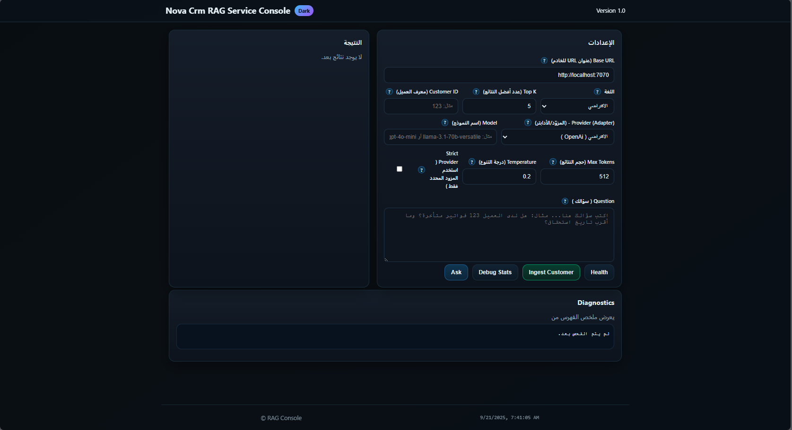

# 🧠 Multi-Model RAG Orchestrator  

[](./LICENSE)

**Maintained by Future Solutions Dev : Sabry Dawood**  
Flexible orchestrator for 10+ AI model providers with built-in **RAG** for indexing and retrieving your data.

---

## 🖼️ Preview



---

## 🌐 Languages

English | [العربية](Docs/README.ar.md)

---

## 🚀 Overview

A smart coordination layer running on top of multiple providers (OpenAI, Anthropic, Gemini, Mistral, Cohere, Ollama, Groq, DeepSeek, xAI, Azure OpenAI) that automatically selects the best provider based on latency and cost.  
It supports:

- Smart router with `failover`, `roundRobin`, `weighted`, `smart` strategies
- **Built‑in RAG** with in‑memory vector store (swappable with pgvector/Pinecone)
- Resilience (Circuit Breaker, timeouts, retries)
- Usage metrics (latency/tokens/cost)
- Easy extensibility — add a new provider with a small class

---

## 📦 Installation & Run

```bash
cp .env.example .env   # Add your provider keys
npm install
npm run dev
# Runs on http://localhost:7070
```

---

## 🔌 API Endpoints

| Method | Endpoint                     | Description |
|-------|------------------------------|-------------|
| GET   | `/`                          | Serves `index.html` from the public folder |
| GET   | `/rag/health`                | Health check |
| GET   | `/rag/debug/stats`           | View index stats (for debugging) |
| POST  | `/rag/ingest/customer/:id`   | Ingest a specific customer's data |
| POST  | `/rag/ingest/all`            | Ingest all customers (returns success/fail count) |
| POST  | `/rag/query`                 | Query RAG with `top_k`, `language`, `customerId`, `provider`, `model` options |

---

## 🛠️ Internal Flow

1. Receive question & normalize  
2. Embed question → vector  
3. Vector search (Top‑K)  
4. Build context from top matches  
5. Route request to best provider  
6. Generate answer  
7. Attach references & metrics  
8. Return result to API/UI  

---

## 📚 Data Indexing

- Split documents into 500–1000 char chunks with 50–150 char overlap
- Generate embeddings & store with metadata (source, date, category)
- Re‑index only affected parts on updates
- Optionally add language fields for multilingual search

---

## 🔐 Security & Monitoring

- Store keys in a proper Secret Manager
- Avoid logging sensitive data
- Monitor latency & usage via OpenTelemetry or pino + Grafana/ELK

---

## ⚡ Performance Tips

- Use caching (e.g. Redis) for contexts & answers
- Batch embeddings to reduce API calls
- Prefer pgvector/Pinecone for production instead of in‑memory store
- Tune `k`, `temperature`, and chunk size for best results

---

## ❓ FAQ

- **What if I don't have all API keys?** → Only available providers will be used, others auto‑disabled  
- **Can I run offline?** → Yes, via Ollama locally  
- **How do I add a new provider?** → Create a new class implementing `LLMProvider` and register it in `providers[]`  

---

## 🧾 Quick Example (TypeScript)

```ts
import { Rag, Router, VectorStore } from "./Router";
async function demo(){
  // 1) Seed knowledge
  await VectorStore.upsert([
    { id: 'doc-1', text: 'Our refund policy allows returns within 30 days of purchase for undamaged items.' },
    { id: 'doc-2', text: 'Support hours are Sunday to Thursday, 9:00 to 18:00 Africa/Cairo time.' },
    { id: 'doc-3', text: 'Contract ABC for Future Solutions Dev expires on 2025-10-12 with monthly fee 10,000 EGP.' },
    { id: 'doc-4', text: 'Invoices are due within 14 days of issue date unless otherwise stated.' },
    { id: 'doc-5', text: 'KPI dashboard aggregates ContractHistories to compute on-time payment rates.' },
  ]);

  // 2) Ask question via RAG
  const q = 'When does Future Solutions Dev contract end and what is the monthly fee?';
  const ans = await Rag.answer(q, { k: 4, temperature: 0.1 });
  console.log('\\n=== ANSWER (RAG via multi-model router) ===');
  console.log({ output: ans.output, provider: ans.providerId, model: ans.model, refs: ans.references });

  // 3) Direct chat without RAG
  const chat = await Router.generate([
    { role: 'system', content: 'You are an expert CTO assistant. Answer concisely.' },
    { role: 'user', content: 'Compare OpenAI and Anthropic briefly.' },
  ], { temperature: 0.3, maxTokens: 200 });
  console.log('\\n=== RAW CHAT (router) ===');
  console.log(chat);
}

if (require.main === module) {
  demo().catch(e => { console.error(e); process.exit(1); });
}
```

---

## 📜 License

This project is licensed under **[Apache License 2.0](./LICENSE)**  
You are free to use, modify, and distribute this code (personal or commercial) as long as you keep attribution to Future Solutions Dev.
